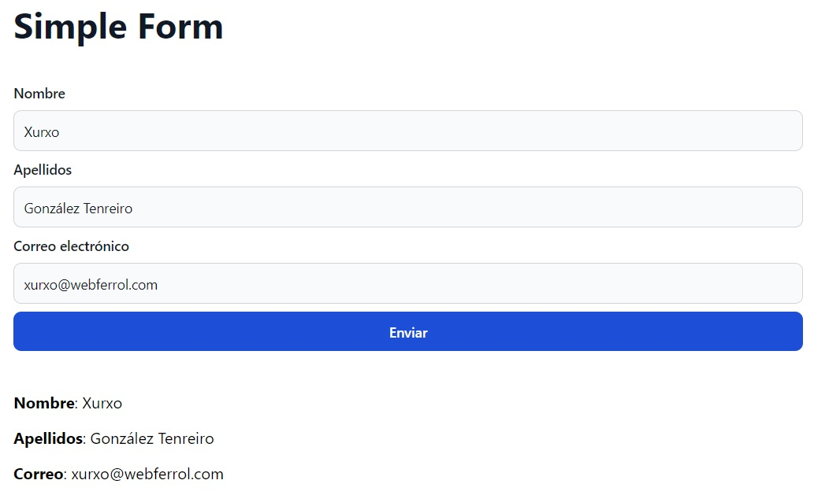
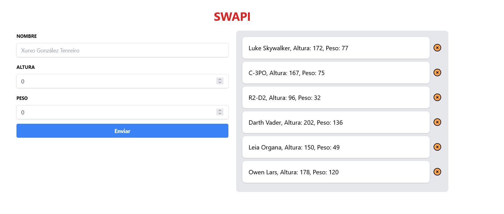

# React

[Invitación a Classroom](https://classroom.google.com/c/NTg0NTY4MTAxMTg4?cjc=eyufnhy)

## JavaScript imprescindible

### import / export

1. Exportación: primitivos, no primitivos, funciones

```js
export let variable_name
export function function_name() {
  // Statements
}
export const USUARIO = { name: 'Xurxo', edad: 50 }
```

2. Exportación por defecto

```js
export default function app () {
    // Statements
}
```

3. Importaciones (nombradas y por defecto)

```js
import miApp, { variable_name, USUARIO, function_name } from 'path_to_file'
```

### Destructuring

```jsx
const YO = { 
  nombre: 'Xurxo',
  apellido1: 'González',
  apellido2: 'Tenreiro'
}

// Desetructuración de un "Objeto Literal"
const { nombre, apellido1, apellido2 = 'Desconocido' } = YO

```

La __desestructuración__ la utilizamos siempre aunque a veces no nos demos cuenta. Por ejemplo cuando desestructuramos las __props__ de un componente:

```jsx
function MiApp ({ value }) {
  return (<div>{value}</div>)
}
```

También podemos _desestructurar_ un __array__:

```jsx
const numeros = [1, 2, 3]

const [num1, num2, num3] = numeros
```
### Búsqueda en arrays

Sólo algunos ejemplos:

- [Array.prototype.indexOf()](https://developer.mozilla.org/es/docs/Web/JavaScript/Reference/Global_Objects/Array/indexOf)
- [Array.prototype.includes()](https://developer.mozilla.org/es/docs/Web/JavaScript/Reference/Global_Objects/Array/includes)
- [Array.prototype.some()](https://developer.mozilla.org/es/docs/Web/JavaScript/Reference/Global_Objects/Array/some)
  
### Fetch

Para obtener datos de un servidor donde el __end point__ es una __API Rest__

- [fetch](https://developer.mozilla.org/es/docs/Web/API/fetch)

__fetch__ es un __método__ del objeto global (en caso del navegador sería __window__) que lanza una petición de un recurso de red. Lo que devuelve es una promesa.

```js
Promise<Response> fetch(input[, init]);
```

En el ejemplo que veremos a continuación el __input__ será un __string__ que representa la localización del recurso de red que deseamos obtener. En este caso un fichero plano __json__ que posteriormente lo convertiremos en un __objeto javascript__ con el método __json()__

```js
fetch('https://swapi.dev/api/people/1')
  .then(response => response.json())
  .then(data => console.log(data))
```

Existe también otra alternativa de lanzar fetch a través de una función asíncrona

```js
async function getPeople () {
  const response = await fetch('https://swapi.dev/api/people/1')
  const data = await response.json()
  console.log(data)
}
```

### Array.prototype.map

> El método map() crea un nuevo array con los resultados de la llamada a la función indicada aplicados a cada uno de sus elementos.
> <cite>[Mozilla Docs](https://developer.mozilla.org/es/docs/Web/JavaScript/Reference/Global_Objects/Array/map)<cite>

__IMPORTANTE__: Los resultados de cada __iteración__ se deben __retornar__.

```jsx
var numbers = [1, 5, 10, 15]
var doubles = numbers.map(function (x) {
   return x * 2; // AQUÍ EL RETORNO
})
// doubles is now [2, 10, 20, 30]
// numbers is still [1, 5, 10, 15]
```

Para __renderizar listas__ a través de expresiones son perfectas. Ejemplo de [react.dev](https://es.react.dev/learn#rendering-lists):

```jsx
const products = [
  { title: 'Cabbage', id: 1 },
  { title: 'Garlic', id: 2 },
  { title: 'Apple', id: 3 },
]

function ProductsApp () {
  const listItems = products.map(product =>
    <li key={product.id}>
      {product.title}
    </li>
  )

    <ul>{listItems}</ul>
  return (
  )
}
```


## React. ¿Qué es?

Como indica su [página oficial](https://es.react.dev/) se trata de una __biblioteca__ o __librería__ para la creación de __interfaces__ des usuario _web_ y _nativas_.

No es más que una  __librería nativa de JavaScript__ que nos facilita el trabajo a la hora de __renderizar__ código, trabajar con __estados__ y mucho más.

## Librerías de React

Para trabajar con __reactjs__ son imprecindibles dos __dependencias__

```js
import React from 'react'
import ReactDOM from 'react-dom/client'
```

Estas serán colocadas en el __entry point__ de nuestro proyecto. Por ejemplo en __vitejs__ sería __main.jsx__

## Functional Component

En __react__ los __componentes__ son __funciones__ que retornan un __elemento react__ y no un __elemento del DOM__

```jsx
/*
 * Function Component
 * @return {React.Element} ¡No retorna un DOM.Element'
*/
function XurxoApp () {
  return (<>Soy Xurxo</>)
}
```

## Impresión de expresiones (variables, constantes, literales, objetos, retorno de funciones ....)

Un __componente react__ siempre retorna una __etiqueta de marcado__. Pero estas marcas no son __JavaScript__

```jsx
  return (<h1>Hola</h1>)
```

Si deseamos escribir JavaScript puro entre estas marcas o sea utilizar __expresiones__, en __React__ se deben utilizar las llaves de apertura y cierre: __{expresión}__. Mira el siguiente __Functional Component__:

```jsx
function Saludar () {
  const nombre = 'Xurxo'
  return (
    <h1>Hola {nombre}</h1>
  )
}
```

## Props

Las __props__ son las _propiedades_ de un __componente__. Son datos que se pasan de un componente padre a un componente hijo. Por ejemplo, si tienes un componente Button que muestra un botón, puedes pasarle una __prop__ text para que el botón muestre ese texto:

```jsx
function Button(props) {
  return <button>{props.text}</button>
}
```

Debe considerarse además que al usar cualquier expresión _JavaScript_ dentro de _JSX_ debe envolverlos con _{}_, en este caso el objeto __props__, de otra forma _JSX_ lo considerará como texto plano. En el ejemplo anterior podemos lanzar el __componente__:

```jsx
<>
  {/* Pasamos un valor de tipo string */}
  <Button text='1' />
  {/* Pasamos un valor de tipo number */}
  <Button text={1} />
</>
```

## Responder eventos

```jsx
function MyButton() {
  function handleClick() {
    alert('You clicked me!');
  }

  // ¡Nota que onClick={handleClick} no tiene paréntesis al final! No llames a la función manejadora de eventos
  return (
    <button onClick={handleClick}>
      Click me
    </button>
  );
}
```

## Hooks

Los __hooks__ son una _API de React_ que nos permite __tener estado__, y otras características de React, en los componentes creados con una function.

Un __hook__ es gancho y, precisamente, lo que hace, es que te _permiten enganchar tus componentes funcionales a todas las características que ofrece React_.

### useStates

A menudo, querrás que tu __componente__ _recuerde_ alguna información y la muestre. 

El _hook_ __useState__ es utilizado para __crear variables de estado__, quiere decir que su valor es __dinámico__, que este _puede cambiar_ en el tiempo y eso requiere una re-renderización del componente donde se utiliza.

```js
const [count, setCount] = useState(0);
```
En el ejemplo de arriba el _hook_ __useState__:

1. Recibe un parámetro:
  - El valor inicial de nuestra variable de estado.
2. Devuelve un _array_ con dos variables:
  - En primer lugar tenemos la variable que contiene el valor.
  - La siguiente variable es una __función set__, requiere el nuevo valor del estado, y este modifica el valor de la variable que anteriormente mencionamos.

```jsx
import { useState } from 'react';

function MyButton() {
  const [count, setCount] = useState(0);

  function handleClick() {
    setCount(count + 1);
  }

  return (
    <button onClick={handleClick}>
      Clicked {count} times
    </button>
  );
}
```
## Ejercicios

1. [x] Crea un Componente botón y renderízalo en tu app
2. [x] Crear un fichero js con un __objeto literal__ con la información de tu nombre, apellidos y edad. Expórtalo y muestra los resultados en tu __app__
3. [x] Intenta recrear la siguiente captura de pantalla [Solución](https://github.com/webferrol/react-counter-project.git)

4. [x] Reproducir la siguiente captura de pantalla [Solución](https://github.com/webferrol/react-simple-form.git)

5. [] Reproducir la siguiente captura de pantalla



  # Sesión 7

  1. Star Wars Api
   - Crear componentes:
    - Formulario
    - Listado de personajes (Estos podrán eliminarse de la lista)